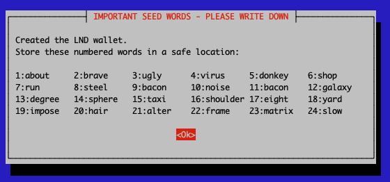

# Final Steps
Time to finish up the setup.

Finally you have to set 3 passwords called A, B & C.
For each password please choose unique, single strings, without spaces and special characters, that are at least 8 chars long.

You can use this [RaspiBlitz Recovery Sheet (PDF)](https://github.com/rootzoll/raspiblitz/raw/v1.7/home.admin/assets/RaspiBlitzRecoverySheet.pdf) to write those passwords down for safe storage and also use it later on for your Seed Words.

___TODO: Not sure about the info boxes. They feel like they are too prominent and detract from the actual content___

:::info 
The password A,B,C idea is based on the [RaspiBolt Guide Preparations](https://raspibolt.org/guide/raspberry-pi/preparations.html#write-down-your-passwords) - check out for more background.
:::

First, password A is requested - this is the password which will be used for SSH login and it's also set for the existing users: admin, root, bitcoin & pi.

:::info 
The bitcoin and lightning services will later run in the background (as daemon) and use the separate user “bitcoin” for security reasons.
This user does not have admin rights and cannot change the system configuration.
:::

Then enter password B - this is internally used for the bitcoin RPC interface.
It is also used as login for additional apps like the RTL-WebGUI or the Blockexplorer.

And finally enter password C - this is used to encrypt/lock the lightning wallet on the hard drive/SSD and is used by LND.
Every time a lightning node is started/rebooted LND needs load the wallet into memory to work with and ask you for password C to "unlock" the wallet.

:::info
In the early RaspiBlitz versions there was also an additional password D, that is no longer in use.
:::

After this the setup process will need some time to set everything up - just wait until it's finished.
This can take from 10 to 30 minutes:

### Final Setup

Once the basic setup has completed your lightning node will be setup & your lightning wallet will be created for you.
As part of this process you will be presented with your lightning node "seed words" which you _MUST_ write down on paper (or engrave into steel) and store in a secure location.
You will need to confirm that you wrote the seed words down before you can continue.

WRITE YOUR SEED WORDS DOWN before you continue - you will need them to recover funds in case of failing hardware etc.
If you just want to try/experiment with the RaspiBlitz, at least take a photo of the seed words with your smartphone, so you have something just in case.
If you plan to keep your RaspiBlitz running store this word list offline or in a password safe.

You can use this [RaspiBlitz Recovery Sheet (PDF)](https://github.com/rootzoll/raspiblitz/raw/v1.7/home.admin/assets/RaspiBlitzRecoverySheet.pdf) to write down your seed words for safe storage.

If you don't have a full copy of the blockchain pre-synced/validated on your hard drive/SSD then you will now be asked how you want to get your copy of the blockchain.
There are two basic options :

